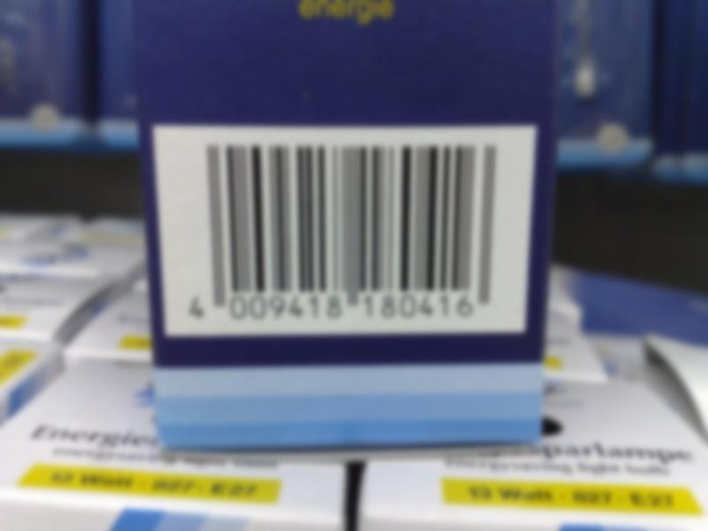
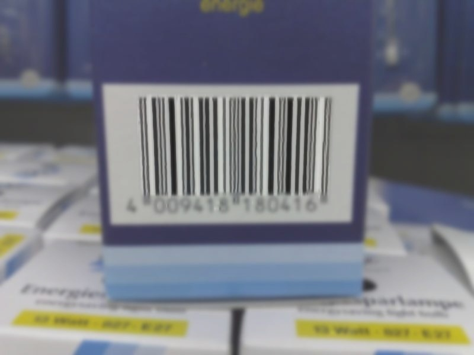
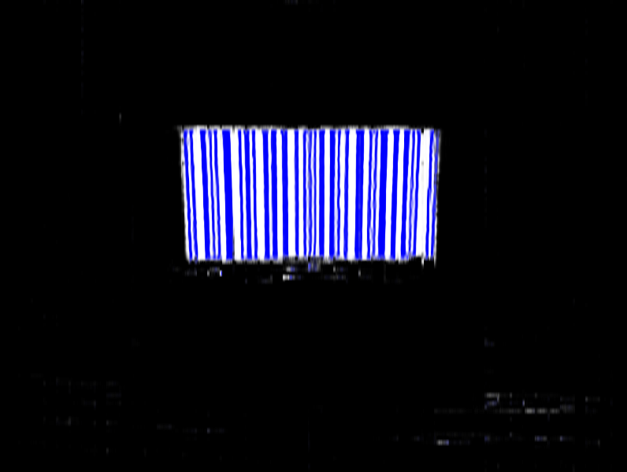
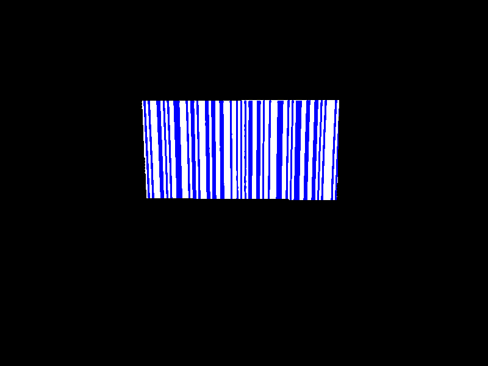

# acres
acres is a tool for sharpening barcodes. Specifically, it is an implementation
of a convolutional neural network designed for preprocessing blurry images of
1D barcodes.

For details of the architecture and implementation, see [ARCHITECTURE.md](./ARCHITECTURE.md).

## Example
The network takes an image and performs segmentation; for every pixel, it tries to predict whether it is:

 - not a part of a barcode
 - a white bar
 - a black bar

### Input image

### Unblurred image

### Prediction mask

### Ground truth mask - what the network would output in the ideal case


Even though the image is heavily blurred, the network manages to extract a reasonable prediction.

## Installation
We use [Git Large File Storage](https://git-lfs.github.com/) to store the dataset in the repo.
Please install Git LFS and then clone this repo using `git lfs clone` rather than `git clone`
for better performance.

acres requires Python 3.4 or higher. We recommend to use virtualenv for
installation; the `install.sh` script should install the package in this way.
Prediction and certain scripts in the `scripts` directory also require OpenCV
(which must be installed separately), although this is not necessary for training.
The simplest way to install OpenCV is running `pip3 install opencv-python` from inside
your virtualenv.

## Usage

### Local training
To run training locally, we may use:
```
python -m acres.binarization.task \
    --dataset-dir data/muenster_blur/ \
    --train-steps 500 \
    --job-dir logs/example/
```
where `--dataset-dir` is the path to the dataset (should have `images` and `masks` subdirectories)
and `--job-dir` is the directory which will contain log files. The training should finish in a few
minutes on a regular laptop.

To see the progress of the training, we can use Tensorboard, which should be installed automatically with Tensorflow.
Run `tensorboard --logdir logs/example/ --port 6006` and open `localhost:6006` in a browser.
- The _Scalars_ tab contains charts of loss, accuracy and binarization accuracy.
- The _Images_ tab contains visualisations of predictions during training. Under `masked`, there are images
  overlaid with the predicted classes - one is highlighted in red, the other in blue.

### Training on Google Cloud Platform
Because acres uses Tensorflow's Estimator API, it can be seamlessly deployed on Google Cloud Platform's
[ML Engine](https://cloud.google.com/ml-engine/). We can also use the GPU for computations, which
gives us a great speed-up.

For example, this is the command (except for different GCP Storage bucket names) which was used
to train the final network:
```
gcloud ml-engine jobs submit training example_acres_training_(date "+%Y_%m_%d_%H%M%S") \
    --module-name acres.binarization.task \
    --package-path acres/ \
    --job-dir gs://my-bucket-for-logs/change_penalty/ \
    --config gcp_config.yaml  \
    --region us-east1 \
    --scale-tier BASIC_GPU \
-- \
    --network-name strided32 \
    --dataset-dir gs://my-bucket-for-data/muenster_blur \
    --batch-size 500 \
    --train-steps 30000 \
    --change-penalty 100
```

### Predictions
Assuming you ran the command from the _Local training_ section, you can predict the test set with the following command.
Replace the `--model-name` argument with the name of the subdirectory created in `logs/example`, which is where the trained model's
weights are saved.
```
python -m acres.binarization.predict \
    --job-dir logs/example/ \
    --network-name strided32 \
    --dataset-dir data/muenster_blur/ \
    --batch-size 50 \
    --model-name task.py-2018-01-01_123456-my-model-name
```
The command will create a `predictions` subdirectory in the model's directory containing the predictions for the test set
(which is an automatically chosen subset of the images in `--dataset-dir`). For each pixel, the probabilities of the classes
are encoded as RGB:

- Red: White part of a barcode
- Green: Not in a barcode
- Blue: Black part of a barcode

There is also a module which can take the predictions and use them to unblur the input images:
```
mkdir -p results/example
python -m acres.evaluation.mask_images \
    ./data/muenster_blur/images/ \
    ./logs/example/task.py-2018-01-01_123456-my-model-name/predictions/ ./results/example/ --mask-weight 0.3
```
This is what was used to produce the example unblurred image.
